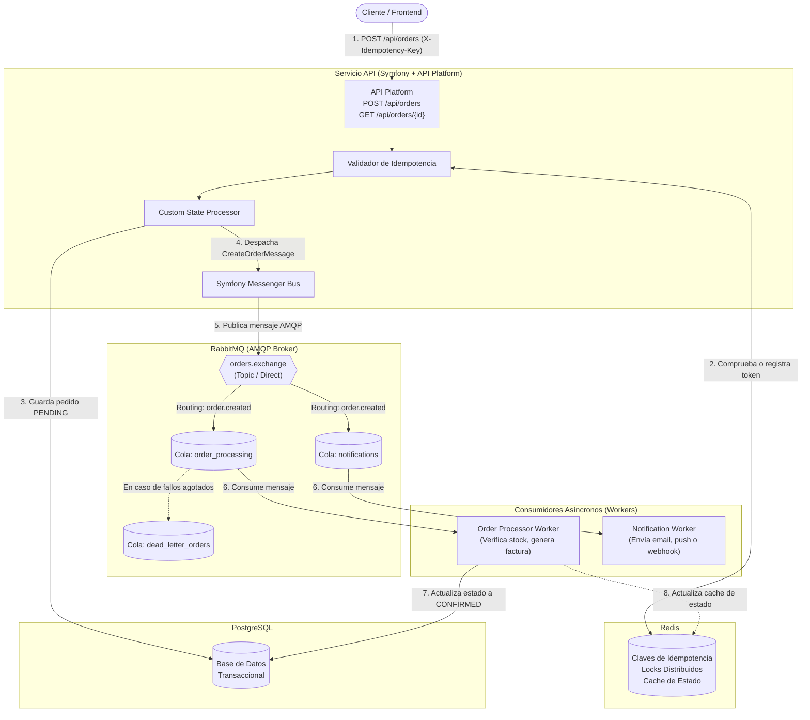

# Arquitectura y Caso Práctico: Sistema de Procesamiento de Pedidos (Order Processing)

Este documento detalla la arquitectura técnica y el caso práctico seleccionado para construir la base de microservicios con **Symfony**, **API Platform**, **Symfony Messenger**, **Redis** y **RabbitMQ**.

---

## 1. Justificación del Caso Práctico

El **Sistema de Procesamiento de Pedidos (Order & Checkout Processing)** es el estándar de la industria para arquitecturas desacopladas y asíncronas por las siguientes razones:

1. **Desacoplamiento Síncrono / Asíncrono:** La creación del pedido debe responder de inmediato al cliente HTTP con un estado inicial (`PENDING`), sin bloquearse esperando cobros, reserva de stock o envíos de correo.
2. **Escalabilidad y Resiliencia:** Si el servicio de correos o facturación se cae, el pedido no se pierde; queda encolado en **RabbitMQ** para reintentos o **Dead Letter Queues (DLQ)**.
3. **Control de Idempotencia:** Permite implementar claves de idempotencia con **Redis** para evitar procesar cobros o pedidos duplicados ante reintentos de red del cliente.
4. **Separación de Responsabilidades (CQRS):** Separación nítida entre la escritura/comando (`CreateOrderCommand`) y la consulta/lectura (`Order` resource).

---

## 2. Diagrama de Arquitectura de Alto Nivel

---

## 3. Rol de Cada Componente

### 3.1. API Platform
* **Exposición REST & OpenAPI:** Genera automáticamente la documentación interactiva Swagger (`/api/docs`), esquemas JSON-LD / Hydra o HAL.
* **Recurso de Dominio (`Order`):** Expone operaciones:
  * `POST /api/orders`: Crea una orden de compra.
  * `GET /api/orders/{id}`: Consulta el estado actualizado del pedido.
* **Custom State Processor:** En lugar de persistir y hacer todo el procesamiento síncronamente, intercepta el POST, valida la entrada, persiste la entidad base con estado `PENDING` y envía un mensaje al bus de Symfony Messenger.

### 3.2. Symfony Messenger
* **Patrón CQRS / Message Bus:** Actúa como dispatcher desacoplado.
* **Ruteo de Mensajes (`config/packages/messenger.yaml`):**
  * Direcciona mensajes específicos (`CreateOrderMessage`, `SendNotificationMessage`) hacia sus transportes correspondientes (`amqp_orders`, `redis_fast`).
* **Estrategias de Reintento:** Configuración de reintentos exponenciales con multiplicador (`retry_strategy: exponential`) antes de enviar al DLQ.

### 3.3. RabbitMQ (AMQP Broker)
* **Intercambio y Distribución Fiable:**
  * Define un *Exchange* (por ejemplo, `orders_topic`) y distribuye a colas suscritas.
  * Permite que múltiples consumidores independientes (Microservicio de Pagos, Microservicio de Almacén, Microservicio de Notificaciones) reaccionen al mismo evento sin conocerse entre sí.
* **Dead Letter Queue (DLQ):** Aislamiento de mensajes defectuosos o payloads corruptos para auditoría sin detener el procesamiento de la cola principal.
* **Panel de Administración Web:** Visualización de métricas de colas, tasa de consumo y clientes conectados en el puerto `15672`.

### 3.4. Redis
* **Idempotencia:** Guarda pares clave-valor temporales con TTL (ej. `idempotency:order:UUID`). Si llega una petición con la misma clave en curso o ya completada, devuelve la respuesta previa o bloquea la duplicación.
* **Locks Distribuidos:** Si múltiples workers intentan acceder o modificar el mismo recurso concurrente (por ejemplo, el inventario de un producto con stock limitado), se utiliza `Symfony\Component\Lock` con Redis como backend.
* **Cache Rápido de Estado:** Lecturas de alta velocidad para endpoints de polling como `GET /api/orders/{id}/status`.

### 3.5. PostgreSQL 16 con pgvector
* **Persistencia Transaccional:** Almacenamiento ACID relacional para entidades (`Order`, `OrderItem`, logs de eventos e historial de estados).
* **Soporte Vectorial (`pgvector`):**
  * Habilita tipos de datos `vector` para almacenar y consultar *embeddings* generados por modelos de lenguaje o machine learning.
  * Permite búsquedas por similitud de cosenos (`<=>`) o distancia euclidiana (`<->`).
  * Casos de uso integrados: Búsqueda semántica en catálogos de productos, recomendaciones personalizadas basadas en historial de pedidos o clustering y clasificación inteligente de incidentes/tickets.
