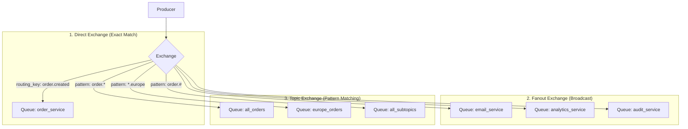
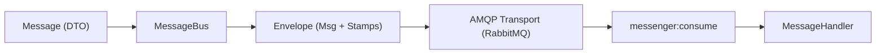

# RabbitMQ & Arquitecturas Asíncronas: Guía de Conceptos Clave para Entrevistas

Esta guía condensa la terminología, patrones arquitectónicos, garantías de entrega y preguntas frecuentes sobre **RabbitMQ**, **Sistemas de Mensajería Asíncrona** y **Symfony Messenger**, orientada a entrevistas técnicas (Senior / Tech Lead).

---

## 1. Glosario Fundamental: La Anatomía de RabbitMQ

| Concepto | Definición Técnica | Metáfora de Entrevista |
| :--- | :--- | :--- |
| **Broker** | El servidor intermediario (RabbitMQ) encargado de recibir, almacenar y entregar mensajes. | La oficina central de correos. |
| **Producer (Productor)** | La aplicación o servicio que crea y envía mensajes al broker. | Quien deposita una carta en el buzón. |
| **Consumer (Consumidor/Worker)** | El proceso que se suscribe a una cola, extrae mensajes y ejecuta la lógica de negocio. | El destinatario o transportista que procesa la carta. |
| **Exchange** | Entidad receptora dentro del broker. Recibe el mensaje del productor y decide a qué cola(s) enrutarlo según sus reglas y la routing key. | El clasificador postal. |
| **Queue (Cola)** | Buffer FIFO (memoria/disco) donde se almacenan los mensajes hasta que un consumidor los procesa. | El buzón físico de entrega. |
| **Binding** | La relación o enlace configurado entre un Exchange y una Queue. | La regla de reparto ("si es de la zona X, va a este buzón"). |
| **Routing Key** | Etiqueta o clave que el productor adjunta al mensaje para que el Exchange sepa cómo enrutarlo (ej: `order.created`). | El código postal escrito en el sobre. |
| **Connection vs Channel** | **Connection:** Conexión TCP real entre cliente y broker. **Channel:** Canal virtual multiplexado dentro de la conexión TCP. | La conexión es la autopista; los canales son los carriles. Permite miles de hilos sin agotar sockets TCP. |

---

## 2. Tipos de Exchange y Cuándo Usar Cada Uno

En una entrevista siempre preguntan: *"¿Qué tipos de Exchange existen y en qué caso usarías cada uno?"*

1. **Direct Exchange (Coincidencia exacta):**
   * El mensaje se entrega a las colas cuyo *binding key* sea exactamente igual al *routing key* del mensaje.
   * *Caso de uso:* Enrutamiento de tareas directas (ej: `pdf.generate`).
2. **Fanout Exchange (Broadcast / Difusión):**
   * Ignora la routing key por completo. Duplica y envía el mensaje a **todas** las colas enlazadas a él.
   * *Caso de uso:* Patrón Pub/Sub puro. Un evento ocurre (`UserRegistered`) y notificas a Email, Auditoría y Analítica al mismo tiempo.
3. **Topic Exchange (Patrones con comodines):**
   * Enruta usando cadenas separadas por puntos (ej: `tienda.europa.pedido.creado`).
   * Permite comodines:
     * `*` (asterisco): Sustituye **exactamente una palabra**.
     * `#` (almohadilla/hash): Sustituye **cero o más palabras**.
   * *Caso de uso:* Arquitecturas de microservicios con enrutamiento granular (ej: `order.*` para todo lo de pedidos, o `order.created.#`).
4. **Headers Exchange:**
   * Enruta basándose en los metadatos/atributos del encabezado del mensaje HTTP/AMQP, en lugar de la routing key. Menos usado por tener menor rendimiento.

---

## 3. Garantías de Entrega y Ciclo de Vida del Mensaje

### A. ACKs (Acknowledgements)
* **Auto-Ack (`no-ack = true`):** El broker borra el mensaje inmediatamente apenas lo entrega al worker por la red. Si el worker cae mientras procesaba, el mensaje se pierde para siempre. **Nunca usar en producción crítica.**
* **Manual Ack:** El worker confirma activamente cuando terminó:
  * `basic.ack`: Todo fue correcto; RabbitMQ elimina el mensaje.
  * `basic.nack` / `basic.reject`: Ocurrió un error. Tiene el parámetro `requeue`:
    * `requeue = true`: El mensaje regresa al principio de la cola para que otro worker lo tome.
    * `requeue = false`: El mensaje es descartado o enviado a la **Dead Letter Queue (DLQ)**.

### B. Persistencia vs Volatilidad
Para que los mensajes sobrevivan a un reinicio o caída total del servidor de RabbitMQ, se necesitan **ambas** condiciones:
1. **Queue Durable:** La cola se crea con la bandera `durable: true` (se registra en disco).
2. **Persistent Message:** El productor publica el mensaje con `delivery_mode: 2` (persistent).

### C. Publisher Confirms
El productor recibe una confirmación del broker indicando que el mensaje fue recibido y persistido en disco antes de dar por buena la operación.

---

## 4. Patrones de Resiliencia (Palabras Clave de Arquitectura)

### 1. Prefetch Count (QoS - Quality of Service)
* **Problema:** Por defecto, RabbitMQ empuja (push) todos los mensajes que puede al consumidor. Si un consumidor recibe 1,000 mensajes pesados de golpe, colapsa por memoria RAM (*Out Of Memory*).
* **Solución:** Configurar `basic.qos(prefetch_count = 10)`. RabbitMQ no le enviará más de 10 mensajes sin confirmar (`unacked`) a ese worker al mismo tiempo.

### 2. Dead Letter Exchange / Queue (DLX / DLQ)
* **Definición:** Un buzón de mensajes "muertos" que no pudieron ser procesados con éxito.
* **¿Cuándo viaja un mensaje a la DLQ?**
  1. Fue rechazado con `basic.reject(requeue = false)` o `basic.nack(requeue = false)`.
  2. El mensaje superó su tiempo de vida máximo (**TTL - Time To Live**).
  3. La cola principal superó su límite de longitud máxima (`x-max-length`).

### 3. Poison Pill (Mensaje Venenoso)
* Un mensaje con datos corruptos o un payload inesperado que provoca una excepción no controlada (`Fatal Error`).
* Si el sistema hiciera siempre `requeue = true`, el worker caería en un bucle infinito de caídas (*crash loop*). La estrategia de reintentos con límite (ej: 3 reintentos) y envío posterior a DLQ evita este problema.

### 4. Idempotencia (*Idempotency*)
* **Pregunta clásica de entrevista:** *"¿RabbitMQ garantiza entrega exactamente una vez (Exactly-once)?"*
* **Respuesta Senior:** **No.** RabbitMQ garantiza **At-least-once (Al menos una vez)**. Si la red parpadea justo después de procesar el negocio pero antes de que llegue el `ACK` al broker, el mensaje se reencolará y otro worker lo recibirá.
* **Cómo se soluciona:** El consumidor **debe ser idempotente**. Se almacena un `Idempotency-Key` o el ID único del mensaje en Redis/Base de datos. Si el ID ya fue procesado, se descarta sin duplicar efectos secundarios (como cobrar dos veces con Stripe).

### 5. Backpressure (Contrapresión)
* Capacidad del sistema de autorregularse cuando los productores generan más tráfico del que los consumidores pueden procesar. RabbitMQ frena la aceptación de sockets si la memoria o el disco caen por debajo de los umbrales de seguridad.

---

## 5. Comparativa para Entrevistas: RabbitMQ vs Kafka vs Redis

| Criterio | RabbitMQ | Apache Kafka | Redis (Streams / PubSub) |
| :--- | :--- | :--- | :--- |
| **Modelo** | Message Broker tradicional (AMQP). Smart Broker, Dumb Consumer. | Event Streaming Platform (Log distribuido append-only). Dumb Broker, Smart Consumer. | In-memory data store con estructuras de colas/streams. |
| **Destrucción de mensajes** | **Se eliminan tras el ACK.** No guarda historial permanente. | **Se conservan** según una política de retención (días, meses o para siempre). | Opcional según memoria/persistencia RDB o AOF. |
| **Replay (Rebobinado)** | No natively (si ya se confirmó, no se puede volver a leer). | **Sí.** Los consumidores mueven su puntero de lectura (*offset*) hacia atrás. | Streams permite lectura por IDs temporales. |
| **Enrutamiento** | Extremadamente flexible (Direct, Topic, Fanout, Headers). | Rígido: Basado en particiones de Topics por clave (`Key hash`). | Simple: canales pub/sub o nombres de clave/stream. |
| **Throughput** | Alto (~decenas de miles msg/seg). | Masivo (~millones de msg/seg en clusters). | Ultrarrápido por operar en RAM, pero limitado a la capacidad de memoria. |
| **¿Cuándo elegirlo?** | Flujos transaccionales complejos, enrutamiento condicional, tareas asíncronas con reintentos y DLQ. | Analítica masiva, Event Sourcing, pipelines de Big Data, trazabilidad histórica continua. | Tareas ultrarrápidas y de corta duración, cachés, locks o pub/sub simple. |

---

## 6. Integración con Symfony Messenger

En el ecosistema Symfony, RabbitMQ se abstrae mediante componentes limpios:

* **Message:** DTO inmutable simple (PHP Object) que representa el comando o evento (ej: `CreateOrderMessage`).
* **Envelope y Stamps:** El mensaje viaja envuelto en un *Envelope*. Los *Stamps* son metadatos que alteran su comportamiento:
  * `DelayStamp`: Retrasa la entrega del mensaje.
  * `RedeliveryStamp`: Cuenta cuántas veces se ha reintentado.
  * `BusNameStamp`: Identifica el bus de origen.
* **Failure Transport:** Configurado en `config/packages/messenger.yaml`. Cuando se agotan los reintentos (`max_retries: 3`), Symfony extrae el mensaje de RabbitMQ y lo envía a la tabla de base de datos (Doctrine) o cola fallida para inspección forense.

### Comandos de Operación en Producción:
* `make consume` (`messenger:consume async_orders`): Levanta el worker.
* `make messenger-failed` (`messenger:failed:show`): Lista mensajes en la DLQ.
* `make messenger-failed-show id=X`: Inspecciona la excepción y el stacktrace completo.
* `make messenger-retry id=X`: Reinyecta el mensaje a la cola tras arreglar el bug.
* `make messenger-reject id=X`: Borra permanentemente el mensaje si es irrecuperable.
* `make messenger-stop` (`messenger:stop-workers`): Envía señal de parada limpia a los workers para despliegues sin cortar ejecuciones en curso.

---

## 7. Preguntas Trampa y Respuestas Sugeridas

#### P1: *"¿RabbitMQ garantiza el orden estricto de los mensajes (FIFO)?"*
> **Respuesta:** Solo bajo una condición: **un único canal y un único consumidor en la cola**.  
> En el momento en que tienes múltiples workers consumiendo en paralelo, o si implementas reintentos con delay (donde un mensaje que falló vuelve a entrar más tarde), el orden cronológico estricto se pierde. Si el negocio requiere orden estricto por entidad, se deben usar particiones ordenadas (estilo Kafka) o locks de negocio en Redis/BD.

#### P2: *"¿Qué sucede si un worker muere en mitad del procesamiento de un mensaje?"*
> **Respuesta:** Dado que usamos confirmación manual (`ACK`), la conexión TCP del worker se cierra abruptamente. RabbitMQ detecta el cierre del socket y automáticamente cambia el estado del mensaje de `Unacked` a `Ready`, reencolándolo para que otro worker disponible lo tome.

#### P3: *"¿Qué harías si la cola de RabbitMQ empieza a crecer sin control (Backlog acumulado)?"*
> **Respuesta:**  
> 1. Revisar métricas: ¿Creció el número de publicaciones o cayó la velocidad de consumo?  
> 2. Escalar horizontalmente el número de workers (`docker compose up --scale worker=5` o HPA en Kubernetes).  
> 3. Revisar el `prefetch_count` para asegurar que los workers procesen de forma equilibrada.  
> 4. Auditar llamadas externas lentas en el Handler (ej: llamadas a pasarelas de pago o APIs lentas) que puedan requerir un timeout más bajo o procesamiento paralelo.
